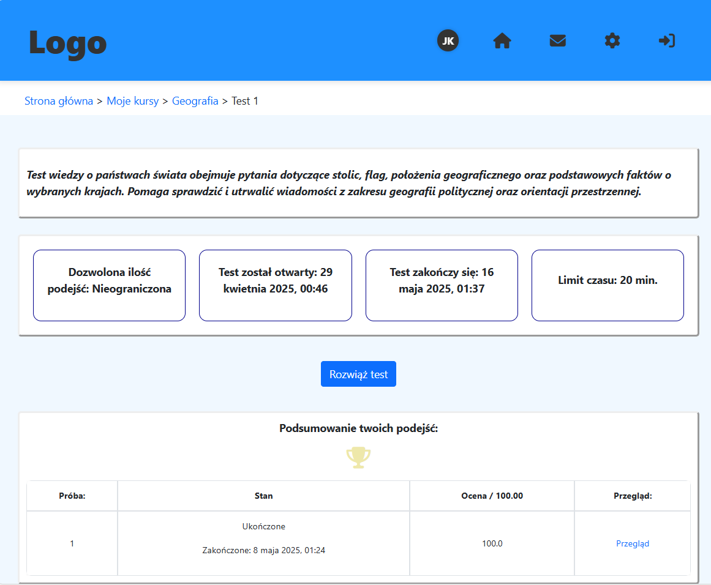
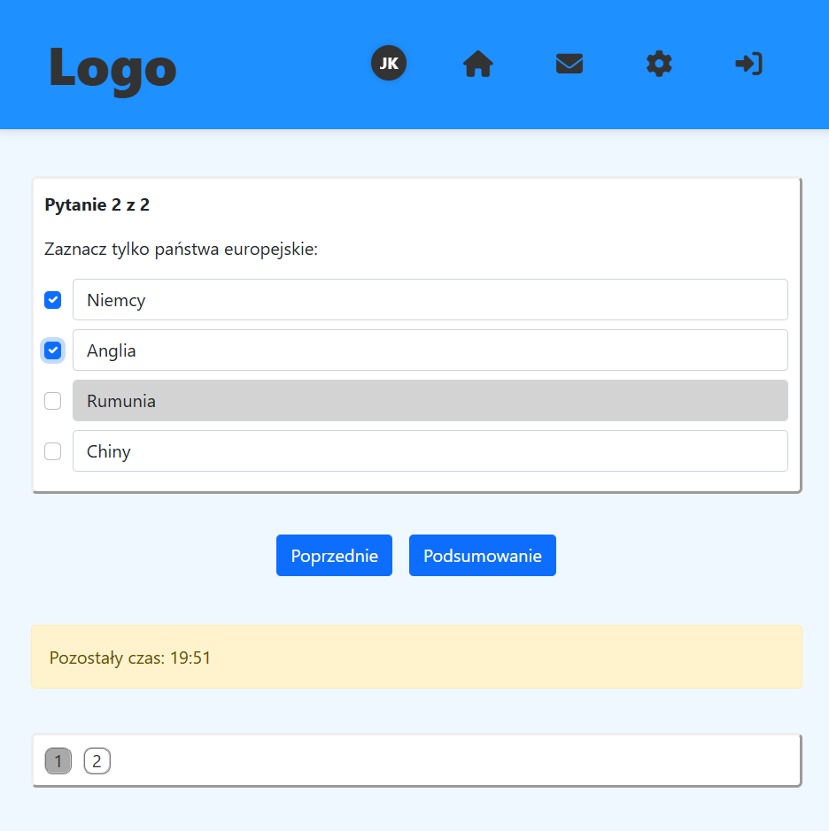

# 🚀 E-Learning App

This is an educational web application for creating and managing courses, tests, and user assessments. Built with Spring Boot.
The app is publicly available at:  https://mkor-e-learning.pl

---

## 🚧 Work in Progress
This application is still under development. Some features might be incomplete, and bugs may occur.
Demo users with limited access are now available.

## Screenshots

#### Course edit

#### Admin user panel

#### Test display

#### Attempt of the test

#### Password change


## 📚 Project Context
This application is a part of a bachelor's thesis project. It is being developed as an academic exercise and is not yet ready for production use.

The goal of the project is to create an e-learning platform using Spring Boot.

## 🛠️ Getting Started

### 1. Clone the Repository
```bash
git clone https://github.com/m4teusz-korzeniowski/e-learning-app.git
cd e-learning-app
```

### 2. Configure Environment
```bash
cp .env-example .env
```

### 3. Run Locally (dev profile)

```bash
./mvnw spring-boot:run -Dspring-boot.run.profiles=dev
```

A preloaded admin account is available (dev only):
- Email: mk@gmail.com
- Password: pass4

### 4. Run with Docker (prod profile)
For production, use Docker. The prod profile is enabled by default in the containerized setup.


---

## 📬 Mail Safety Notice

**Important:**  
Some preloaded email addresses in the dataset are randomly generated and might resemble real accounts.  
Avoid using them for email testing unless configured to use a safe SMTP service like Mailtrap or Brevo.
I strongly recommend replacing email addresses with safe, internal ones before testing live mailing features.
