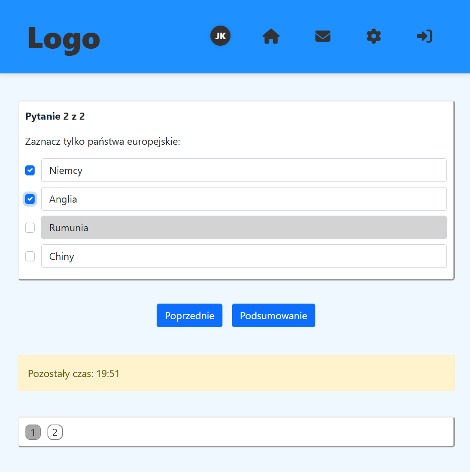

# 🚀 E-Learning App

This is an educational web application for creating and managing courses, tests, and user assessments. Built with Spring Boot.

---

## Screenshots

### Course edit

### Admin user panel

### Test

### Attempt

### Change password


## 🚧 Work in Progress
This application is still under development. Some features might be incomplete, and bugs may occur.

## 📚 Project Context
This application is a part of a bachelor's thesis project. It is being developed as an academic exercise and is not yet ready for production use.

The goal of the project is to create an e-learning platform using Spring Boot.

## 🛠️ Getting Started

### 1. Clone the Repository
```bash
git clone https://github.com/m4teusz-korzeniowski/e-learning-app.git
cd e-learning-app
```

### 2. Set Environment Variables

To enable email, configure the following variables:

```bash
SMTP_USERNAME=your_smtp_username
SMTP_PASSWORD=your_smtp_password
SMTP_FROM=your_email@example.com
```

You can use any SMTP provider: Gmail, Brevo, Mailtrap, etc.

### 3. Choose a Spring Profile

The default profile is `prod` using MySQL. To run with an in-memory H2 database, activate the `dev` profile.

### 4. Database Configuration

#### ✅ Prod (MySQL)
Use `application-prod.yml`:

- `spring.datasource.url`
- `spring.datasource.username`
- `spring.datasource.password`

#### 🧪 Dev (H2)
No configuration required. The schema and sample data are managed via Liquibase.

### 5. Default Admin Login

A preloaded admin account is available for testing:

- Email: `mk@gmail.com`
- Password: `pass4`

Once logged in, you can:
- Create courses and tests
- Manage users
- Attempt tests
- Some features are only available to certain roles

---

## 📬 Mail Safety Notice

Be cautious when using real email addresses from the preloaded dataset. Some are randomly generated and may correspond to real accounts. If unsure, consider replacing them with safe test emails.
